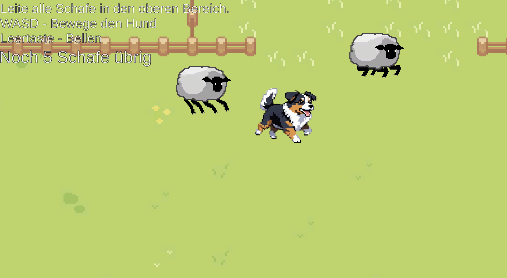
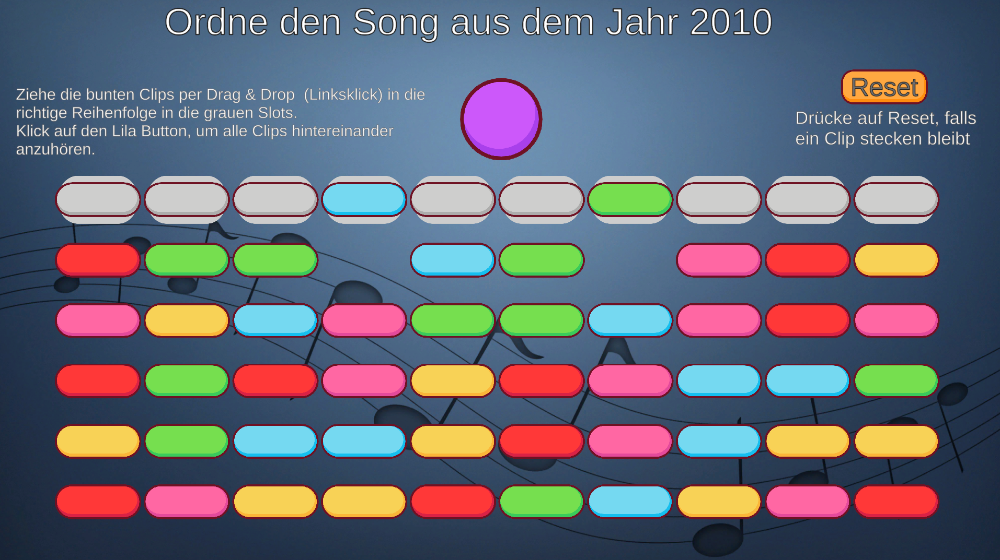

# Ein Spiel als Geburtstagsgeschenk

Dieses Miniprojekt habe ich aus Spaß zum 30. Geburtstag einer Freundin entwickelt.

Zum Starten des Spiels reicht es, den Geburtstagsgeschenk Ordner aus diesem Projekt herunterzuladen und die "my project.exe" im Windows-Betriebssystem zu starten.

Es gibt einmal ein Minispiel, bei dem man Schafe in einen bestimmten Bereich führen muss:

  

Das andere Spiel ist ein Musikspiel, bei dem zum einen ein Lied wieder richtig zusammengebaut werden muss mit den verschiedenen Musikschnipseln und zum anderen wird noch nach dem richtigen Lied gefragt, also das Jahr muss auch übereinstimmen.
Beim Klicken auf die Clips wird der jeweilige Teil des Lieds abgespielt.
Dabei sollte beachtet werden, dass der Clip beim "draggen" wirklich nur den Slot berührt, in den der Clip am Ende auch landen soll. Ansonsten fliegt der Clip immer zur Ausgangsposition zurück.

  

